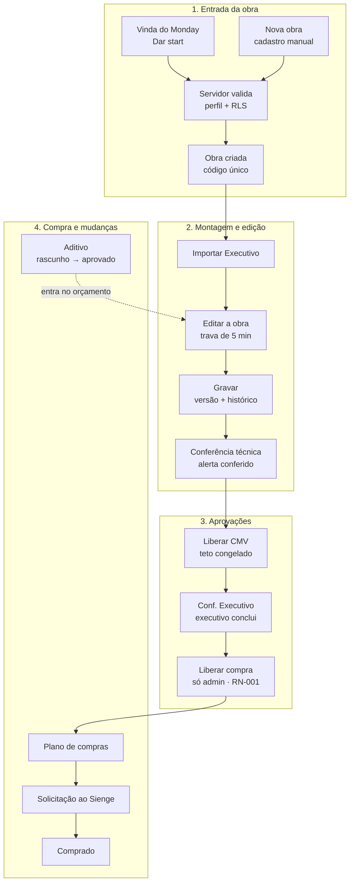

# Ciclo da obra, do início ao fim

**Escopo:** o caminho de uma obra desde a entrada no sistema até a compra, passando por todas
as abas do Planejamento. · **Atualizado em:** 23/09/2026 · **Base:** leitura do código na
branch `develop` (commit `be3400b`).

Este documento junta os fluxos que atravessam várias telas. O detalhe de cada tela mora na ficha
dela, em [`docs/funcionalidades/`](../funcionalidades/README.md), e as regras de negócio moram em
[`docs/regras-de-negocio/`](../regras-de-negocio/README.md).

---

## 1. Visão geral: quatro fases



| Fase | O que acontece | Onde |
|---|---|---|
| 1. Entrada | A obra nasce pelo "Dar start" de uma obra vinda do Monday ou pelo botão "Nova obra". O servidor confere o perfil e grava um único INSERT, com código único. | [cadastro-de-obra](../funcionalidades/cadastro-de-obra.md) |
| 2. Montagem e edição | O Executivo é importado. Uma pessoa edita por vez, segurando uma trava de 5 min; cada gravação vira uma versão no histórico. | [executivo](../funcionalidades/executivo.md), [gravacao-da-obra](../funcionalidades/gravacao-da-obra.md) |
| 3. Aprovações | O CMV é liberado na aba própria. Na Conf. Executivo, o executivo conclui cada linha, confere os alertas técnicos, e o admin libera cada item para compra (RN-001). Desde 18/09/2026 a aprovação do cliente não barra mais nada. | [cmv](../funcionalidades/cmv.md), [conf-executivo](../funcionalidades/conf-executivo.md) |
| 4. Compra | O Plano de Compras é liberado; os itens recebem canal, viram solicitação no Sienge e são marcados como comprados. | [plano-de-compras](../funcionalidades/plano-de-compras.md), [compras-de-produtos](../funcionalidades/compras-de-produtos.md) |

A ordem entre as etapas foi montada a partir das telas e dos campos gravados. **Não existe no
código uma máquina de estados que obrigue essa sequência:** quem tem perfil de edição pode, em
tese, pular etapas chamando a API direto.

### As voltas do fluxo

O desenho é reto, mas no uso real a obra volta para fases anteriores:

| Volta | O que provoca | Observação |
|---|---|---|
| Aditivo aprovado | Entra no orçamento, no CMV e no Plano de Compras e reabre a fase 2. | Ver [aditivo-e-apresentacao](../funcionalidades/aditivo-e-apresentacao.md). |
| Editar item liberado | Desde a RN-002 (23/09/2026) não é possível: o admin desfaz a liberação antes, e o item volta à fase 3. | A RN-002 é conferida na tela e no banco; ver [RN-002](../regras-de-negocio/RN-002-item-aprovado-no-executivo.md). |
| Reabrir compras ou etapa | Desfaz o congelamento do Plano ou a conclusão da etapa. | Qualquer perfil de edição reabre, sem registro de quem reabriu. |

---

## 2. A esteira do Planejamento, aba por aba

A obra tem os grupos Visão geral, Planejamento, Execução e Documentos. O Planejamento é uma
esteira de seis abas (`ETAPAS_PLANEJAMENTO`, `web/src/App.jsx:11149`):

1. Vendido Planilha
2. CMV
3. Executivo
4. Conf. Executivo
5. Plano de Compras
6. Compras de Produtos

A aba "Aprovação do Cliente" saiu da esteira em 18/09/2026: o conteúdo foi para dentro da
Conf. Executivo ([ADR-005](../ADR-005-conferencia-unificada.md)) e, no mesmo dia, saiu também da
tela. Desde então o cliente não barra a liberação nem o Plano de Compras.

### 2.1 O cadeado é só um aviso

Cada aba mostra um cadeado com "conclua X primeiro" enquanto a anterior não está concluída
(`TabBar`, `web/src/App.jsx:11251`). **O cadeado é visual: a aba sempre abre.** O que segura a
obra de verdade são os portões dentro das telas (seção 2.3).

Exceções ao cadeado:

- **Conf. Executivo** não tem cadeado por ordem (`ETAPAS_SEM_TRAVA_DE_ORDEM`,
  `web/src/App.jsx:11189`): é feita junto com o Executivo, a pedido de 16/09/2026.
- **Plano de Compras** e **Compras de Produtos** perdem o cadeado assim que existe um item
  liberado para compra (`temCompraAprovada`, `web/src/App.jsx:11246`), regra de 18/09/2026.

### 2.2 Como cada aba conta como concluída

`etapaConcluida` (`web/src/App.jsx:11209`):

| Aba | Concluída quando | Quem grava |
|---|---|---|
| Vendido Planilha | Botão "Concluir etapa" | `etapasConcluidas.vendido_planilha` com quem e quando |
| CMV | "Liberar CMV" | `deparaAprovado`, `cmvLiberado`, `cmvLiberadoPor`, `cmvLiberadoEm` |
| Executivo | Botão "Concluir etapa" | `etapasConcluidas.executivo` |
| Conf. Executivo | Botão "Concluir etapa", só com zero pendência técnica | `etapasConcluidas.executivo_conferencia` |
| Plano de Compras | "Liberar compra" | `comprasLiberadas`, `compraLiberadaPor`, `compraLiberadaEm` |
| Compras de Produtos | Botão "Concluir etapa" | `etapasConcluidas.compras` |

O botão genérico só existe nas abas de `ETAPAS_COM_CONCLUSAO` (`web/src/App.jsx:11197`). CMV e
Plano de Compras não têm esse botão porque já têm um ato próprio que grava quem e quando.

### 2.3 Fluxograma por aba

Em destaque (`:::portao`) estão os portões que travam a obra de verdade.

```mermaid
flowchart LR
    classDef portao fill:#FAEEDA,stroke:#BA7517,color:#412402

    subgraph VP[Vendido Planilha]
        direction LR
        vp1[Importar planilha<br/>Excel ou PDF] --> vp2[Itens nas verbas] --> vp3[Concluir etapa<br/>só registro]
    end
    subgraph CMV[CMV]
        direction LR
        c1[Somar custo<br/>por grupo] --> c2{CMV > 0?}:::portao --> c3[Liberar CMV<br/>teto congelado]:::portao
    end
    subgraph EX[Executivo]
        direction LR
        e1[Importar planilha] --> e2[Completar na tela] --> e3[Concluir etapa<br/>só registro]
    end
    subgraph CE[Conf. Executivo]
        direction LR
        ce1[Conferir alertas<br/>conferi] --> ce2[Executivo conclui<br/>a linha] --> ce3[Admin libera item<br/>RN-001]:::portao
    end
    subgraph PC[Plano de Compras]
        direction LR
        p1[Definir alocação] --> p2{Acima do CMV?}:::portao --> p3[Liberar compra<br/>congela o anterior]:::portao
    end
    subgraph CP[Compras de Produtos]
        direction LR
        cp1[Escolher canal] --> cp2[Pedido no Sienge<br/>sem volta no ERP] --> cp3[Comprado]
    end

    VP -- não exige conclusão --> CMV
    CMV -- CMV liberado abre as duas --> EX
    EX -- em paralelo, sem ordem --> CE
    CE -- técnica = 0 ou 1 item liberado --> PC
    PC -- mesmo cadeado do plano --> CP
```



#### 1. Vendido Planilha

1. Alguém importa a planilha do vendido, de preferência em Excel. Do PDF saem só descrição,
   quantidade e valor; fornecedor, ambiente e a separação material/mão de obra se perdem.
2. Os itens vão para as verbas da obra, na lista `itensPlanilha` de cada categoria.
3. A importação fica registrada; dá para limpar e importar de novo.
4. "Concluir etapa" marca a aba, mas **nada depois depende dessa marca**: o CMV funciona com
   esta aba em aberto.

#### 2. CMV

Tela: `DeparaContratoPlanilhaView`, `web/src/App.jsx:7286`.

1. A tela soma o custo da Vendido Planilha por grupo e mostra o total.
2. Com total zero, o botão fica desabilitado e aparece "CMV ainda não apurado".
3. "Liberar CMV" pede confirmação e depois (`aprovarDepara`, `web/src/App.jsx:22957`):
   - grava o valor **congelado**, com quem liberou e quando;
   - marca a aba como concluída;
   - abre o Executivo e a Conf. Executivo.
4. O valor congelado é o **teto** da obra. Importar o vendido de novo não muda o teto.

Obra sem vendido: o Executivo oferece "Começar sem Depara" (`comecarExecutivoSemDepara`,
`web/src/App.jsx:22970`). Abre só o Executivo; a obra fica sem teto e o CMV continua pendente.

#### 3. Executivo

Só abre com o CMV liberado ou pela saída "Começar sem Depara".

1. Alguém importa a Planilha Executivo (`importPlanilhaExecutivo`, `web/src/App.jsx:23287`).
   Cada item vai para duas listas:
   - `itensPlanilhaExecutivo`: o documento como veio do arquivo, que a Conf. Executivo compara;
   - `itens`: a lista de trabalho, que alimenta Plano de Compras, Compras e Contratos.

   Iluminação, climatização, móveis soltos e louças/metais já chegam com material e mão de obra
   separados.
2. Cada item é comparado com o vendido da mesma verba.
3. A equipe completa ou corrige na tela: quantidade, custo, item novo, "puxar do criativo".
   Remover exige justificativa e grava quem removeu (`editarItemExecutivo`,
   `web/src/App.jsx:22983`).
4. Item já aprovado para compra, ou já andando na compra (solicitado, comprado, com canal,
   avulso ou de aditivo), não se edita, não se remove e não se substitui, nem pelo admin
   ([RN-002](../regras-de-negocio/RN-002-item-aprovado-no-executivo.md), conferida na tela e no
   banco). Para mexer, o admin desfaz a aprovação antes. Adicionar item novo continua livre.
5. Pela mesma regra, ninguém substitui nem limpa a planilha do Executivo enquanto a obra tiver
   item aprovado.
   Em item ainda não aprovado, mudar o que se compra ou o custo tira o "conferi" do alerta.
6. "Concluir etapa" marca a aba. Cada item também tem a sua marca `concluidoExecutivo`.

#### 4. Conf. Executivo

Exige o CMV liberado, mas não o Executivo concluído.

1. Compara o Vendido Planilha com o Executivo e marca o que divergiu e o que entrou sem ter sido
   vendido.
2. A equipe aprova cada linha (`obra.aprovacoes`).
3. Itens com alerta técnico precisam do "conferi" dado nesta tela. A aprovação da linha não conta
   como "conferi" (decisão de 17/09/2026).
4. **A aprovação do cliente saiu da tela em 18/09/2026** e deixou de barrar a liberação e o
   Plano de Compras ("o cliente deixa de barrar"). A assinatura do cliente pode ser anexada em
   Documentos. O código antigo (assinatura geral, aprovação item a item, "liberar sem cliente")
   continua existindo, mas não é alcançável pela tela; os carimbos que já existem nos itens
   ficam como histórico.
5. **Liberação para compra**, item a item, só pelo admin (RN-001;
   `liberarItensParaCompra`, `web/src/App.jsx:23504`). Um item só pode ser liberado com
   (`podeLiberarItem` e `pendenciaParaLiberar`, `web/src/App.jsx:11424`):
   - alerta técnico conferido, quando o item tem alerta;
   - confirmação, quando o item entrou no Executivo sem ter sido vendido.

   Liberar o item também marca `concluidoExecutivo` nele, se ainda não estava.
6. "Concluir etapa" só funciona com zero pendência técnica (`bloqueioDaEtapa`,
   `web/src/App.jsx:11229`). É a única trava real do botão de concluir.

#### 5. Plano de Compras

Tela: `ComparativoView`, `web/src/App.jsx:4229`.

1. Mostra o Executivo com os aditivos dentro de cada grupo, filtrado em "só o vendido".
2. Para cada item define-se a alocação: compra ou contrato. Dá para separar ou juntar mão de obra
   (por item ou grupo) e criar compra avulsa. Mudar a alocação não pede nova liberação.
3. "Liberar compra" (`LiberacaoCompra`, `web/src/App.jsx:4115`; `liberarCompras`,
   `web/src/App.jsx:23188`):
   - se o custo do Executivo passou do CMV, pede justificativa (mín. 15 caracteres) e o nome de
     quem autorizou, e grava os dois em `estouroAprovado`;
   - grava `comprasLiberadas` com quem e quando e marca a aba como concluída;
   - congela Vendido, CMV e Executivo.
   - A assinatura do cliente deixou de travar esta liberação em 18/09/2026. O código da exceção
     "sem assinatura" ainda existe, desligado (`semAssinatura = false`).
4. "Reabrir" desfaz a liberação (`reabrirCompras`, `web/src/App.jsx:23224`).

#### 6. Compras de Produtos

Tela: `ComprasView`, `web/src/App.jsx:12668`.

1. Para cada material escolhe-se o canal (`CANAIS_COMPRA`, `web/src/App.jsx:2047`): Sienge,
   Mehoo, Automação, Cortinas e Persianas, GC ou Estoque. Filtros por canal (com contador de
   comprados) e por fornecedor.
2. Itens com canal Sienge viram solicitação de compra: usa a EAP do Sienge para a apropriação,
   registra o envio antes de mandar e confere depois se a solicitação existe no Sienge.
   Conciliação pelo PDF do Sienge. Ver
   [ADR-003](../ADR-003-solicitacao-compra-sienge.md).
3. O item passa por solicitado e depois comprado. Dá para trocar o produto e desfazer a troca.
4. "Concluir etapa" marca a aba, sem nenhuma exigência.

### 2.4 O que as abas realmente exigem

```
Vendido Planilha ──(nada exige)──▶ CMV
CMV liberado ─────────────────────▶ abre Executivo e Conf. Executivo (em paralelo)
Conf. Executivo: técnica = 0 ─────▶ permite concluir a aba
1 item liberado (admin) ──────────▶ abre Plano e Compras, mesmo sem concluir a Conf.
Plano liberado ───────────────────▶ congela Vendido, CMV e Executivo
```

Três pontos que confundem quem usa:

1. O cadeado das abas sugere uma ordem que o sistema não obriga.
2. "Concluir" Vendido Planilha, Executivo e Compras não tem efeito em nenhuma outra aba; é só
   registro.
3. Plano de Compras e Compras podem abrir antes de a Conf. Executivo estar concluída, bastando um
   item liberado.

---

## 3. Riscos do fluxo

Levantamento de 23/09/2026, por leitura de código (não reproduzido no app nem no banco). O
detalhe, com arquivo e cenário, está na seção "Riscos conhecidos" de cada ficha.

### Em que o fluxo é sólido

- **Cadastro:** um único INSERT, código único no banco, perfil conferido no servidor e no RLS,
  sem policy de DELETE.
- **Gravação:** trava e versão conferidas no banco na mesma transação (`salvar_obra`, com
  `for update`); dois usuários não gravam um por cima do outro pela API. 38 asserções pgTAP em
  `supabase/tests/12-salvar-obra.sql`.
- **RN-001:** gatilho no banco recusa quem não é admin, carimbo em nome de outra pessoa e cópia
  de carimbo para mais itens.
- **Autoria** de aditivo, apresentação e envio ao Sienge vem do login, nunca do corpo do pedido.

### Onde o fluxo falha

| Gravidade | Fase | Risco |
|---|---|---|
| Alta | Edição | A edição de célula do Executivo acha o item pela descrição: produto repetido em dois ambientes recebe o mesmo patch (quantidade, remoção). Substituir e inserir usam a posição da planilha na lista de trabalho e podem acertar o item errado. |
| Alta | Edição | Conflito falso depois de timeout: o banco grava, a resposta se perde, a próxima tentativa volta 409 e a saída é recarregar, perdendo o que foi editado depois. |
| Alta | Aprovação | Um GC pode mover o carimbo de liberação de um item para outro numa gravação; o gatilho só conta carimbos acrescentados. |
| Alta | Aprovação | A RN-001 pode ser contornada: item com canal, avulso, solicitado ou comprado conta como liberado sem carimbo do admin. |
| Alta | Compra | O envio ao Sienge não confere liberação nem registro no servidor; chamadas repetidas duplicam solicitação, e o Sienge não apaga. |
| Alta | Aprovação | Alerta conferido, conclusão do executivo, aprovações da Conf. Executivo, CMV e Plano aceitam qualquer autor e só a tela exige. |
| Média | Entrada | O banco confere o perfil, não os dados: GC cria obra em nome de outro (e não a enxerga); código de 4 dígitos só validado na tela. |
| Média | Entrada | Obra nova não se liga ao Sienge nem ganha coordenadas na criação. |
| Média | Mudanças | Aditivo muda de status sem regra de transição nem papel; o criador exclui aditivo aprovado. |
| Média | Compra | O status de um envio ao Sienge pode ser rebaixado para "abandonado", o que convida a reenviar. |
| Média | Mudanças | Reabrir compras ou etapas não registra quem reabriu. |
| Média | Edição | Caminhos antigos de escrita no banco sem conferência de versão. |

### Prioridades sugeridas

1. Corrigir a edição de célula do Executivo (afeta Compras hoje).
2. Conferir no servidor o envio ao Sienge: itens liberados e registro prévio. É o único dano
   irreversível.
3. Fortalecer a RN-001 no gatilho: conferir o carimbo item a item (hoje dá para movê-lo de um
   item para outro) e não contar canal/avulso/solicitado como liberação sem o carimbo do admin.
4. Criar regras protegidas para alerta conferido, liberação do CMV e do Plano e status do aditivo, com
   autor vindo do login.
5. Corrigir o conflito falso depois de timeout e fechar os caminhos antigos de escrita.

Os itens 3 e 4 mudam regra de negócio e só podem ser feitos com pedido explícito do dev nomeando
a regra.
